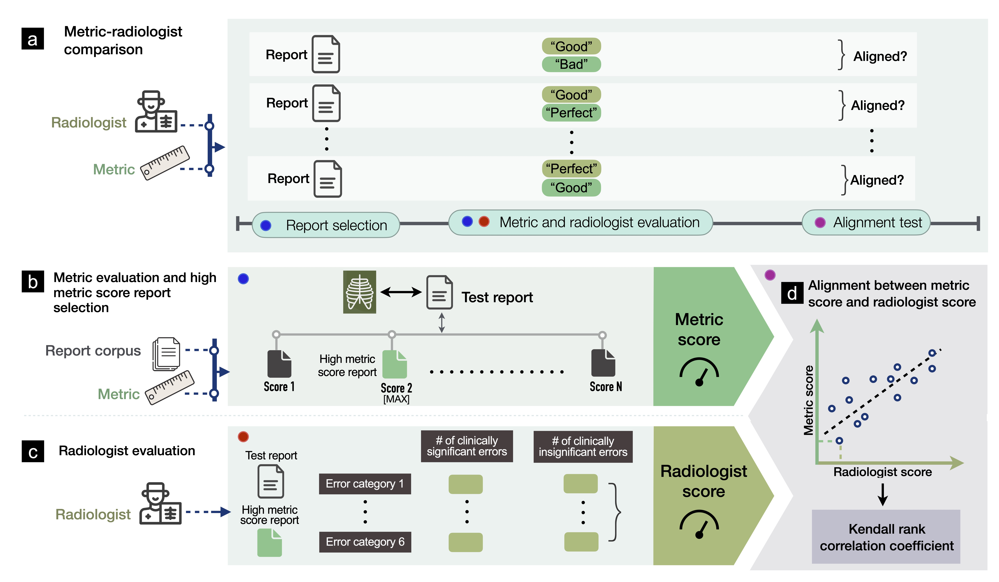

# Measuring Progress in Automatic Chest X-Ray Radiology Report Generation



Repository referenced in the paper "Measuring Progress in Automatic Chest 
X-Ray Radiology Report Generation". This repository provides code for computing
metric scores for radiology report evaluation. The metrics are:
* BLEU
* BERTscore
* CheXbert labeler vector similarity
* RadGraph entity and relation F1
* Composite metric RadCliQ


## Table of Contents
* [Prerequisites](#prerequisites)
* [Requirements](#requirements)
* [Usage](#usage)
* [License](#license)
* [Citing](#citing)


<a name="prerequisites"></a>

# Prerequisites
To install the dependencies, run the following command with Python 3.7:
```
pip install -r requirements.txt
```

<a name="requirements"></a>

# Requirements
Ground Truth and Predicted reports must be arranged in the same order in a
column named "report" in two CSV files. The CSVs should also contain a
corresponding "study_id" column that contains unique identifies for the reports.

In `config.py`, set `GT_REPORTS` and `PREDICTED_REPORTS` to paths to the CSVs.
Set `OUT_FILE` to the desired path for the output metric scores.

## CheXbert
To compute the CheXbert vector similarity (s_emb) metric score, download the
CheXbert model checkpoint [here](https://stanfordmedicine.box.com/s/c3stck6w6dol3h36grdc97xoydzxd7w9).
Set `CHEXBERT_PATH` in `config.py` to the path to the downloaded checkpoint.

The code for computing the CheXbert metric score is adapted from
[stanfordmlgroup/CheXbert](https://github.com/stanfordmlgroup/CheXbert).

Paper (Accepted to EMNLP 2020): https://arxiv.org/abs/2004.09167.

## RadGraph
To compute the RadGraph metric score, download the RadGraph model checkpoint
from PhysioNet [here](https://physionet.org/content/radgraph/1.0.0/).
The checkpoint file can be found under the "Files" section at path
`models/model_checkpoint/`.
Set `RADGRAPH_PATH` in `config.py` to the path to the downloaded checkpoint.

The code for computing the RadGraph metric score is adapted from
[dwadden/dygiepp](https://github.com/dwadden/dygiepp).
Note: You need to apply for credentialed access to RadGraph on PhysioNet.

Paper (Accepted to NeurIPS 2021): https://arxiv.org/abs/2106.14463.


<a name="usage"></a>

# Usage
```
from CXRMetric.run_eval import calc_metric
calc_metric(gt_reports, predicted_reports, out_file)
```


<a name="license"></a>

# License
This repository is made publicly available under the MIT License.


<a name="citing"></a>

# Citing
If you are using this repo, please cite this paper:
```
TODO
```
